# Laporan Praktikum - Jobsheet 3: Migration, Seeder, DB Façade, Query Builder, dan Eloquent ORM

---

## Identitas Mahasiswa
* **Nama:** Mochamad Reza Firdaus
* **NIM:** 244107020104
* **Kelas:** TI-2F
* **Project:** PWL_POS

---

## Praktikum 1 - Pengaturan Database
**Set up database**
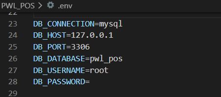
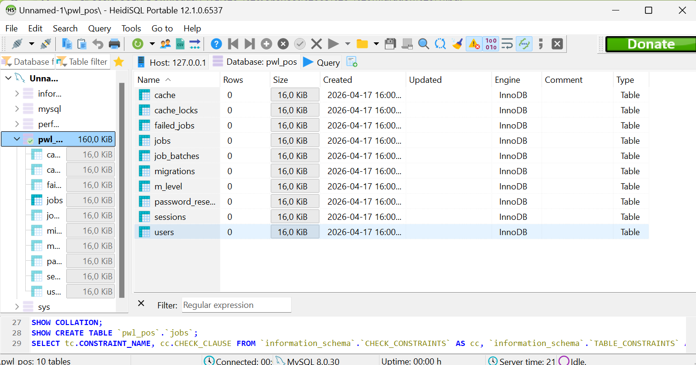

## Praktikum 2 - Migration
**Migration**

### Praktikum 2.1 - Pembuatan File Migrasi Tanpa Relasi
[cite_start]Pembuatan tabel utama yang tidak memiliki *Foreign Key* terlebih dahulu[cite: 159].
1.  [cite_start]**Tabel `m_level`**: Menyimpan data level pengguna[cite: 247].
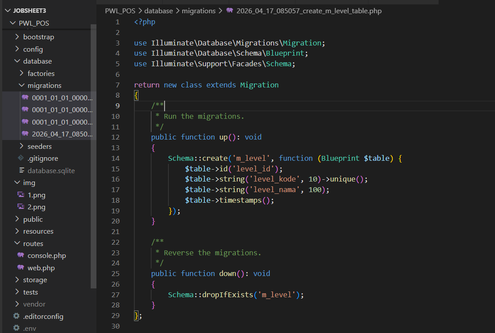
2.  [cite_start]**Tabel `m_kategori`**: Menyimpan kategori produk[cite: 307].
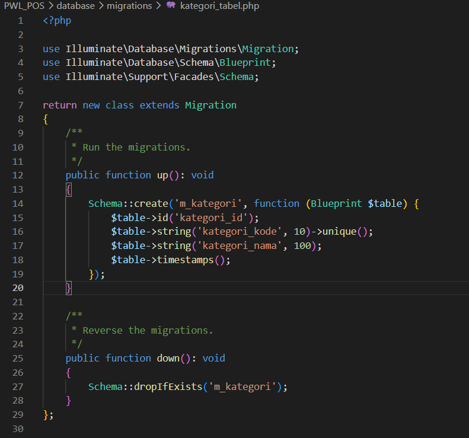
3.  [cite_start]**Tabel `m_supplier`**: Menyimpan data pemasok barang[cite: 307].
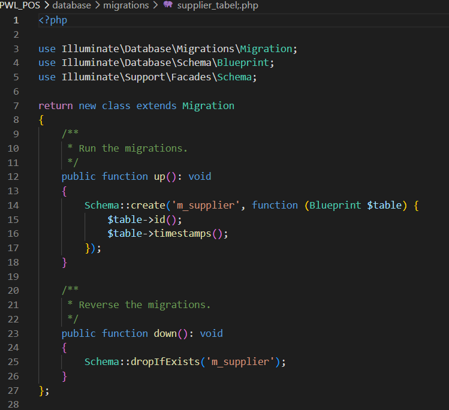
tampilan database
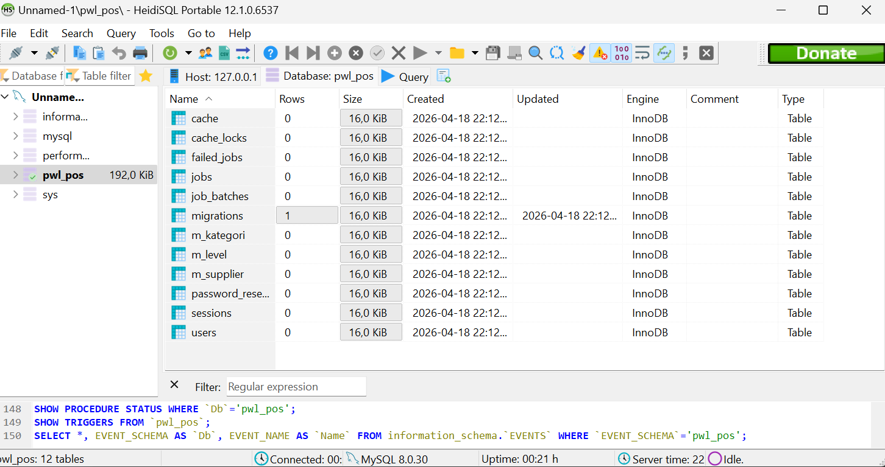

### Praktikum 2.2 - Pembuatan File Migrasi Dengan Relasi
Seluruh tabel hasil migrasi (heidiSQL), relasi sudah ada

## Praktikum 3 - Seeder
[cite_start]Seeder digunakan untuk mengisi database dengan data awal atau data *dummy* agar aplikasi siap digunakan untuk pengujian[cite: 331, 332].

### Hasil Pengamatan
* [cite_start]Berhasil memasukkan data awal ke tabel `m_level` dan `m_user` melalui perintah `php artisan db:seed`[cite: 336, 353].
Seeder untuk tabel m_level
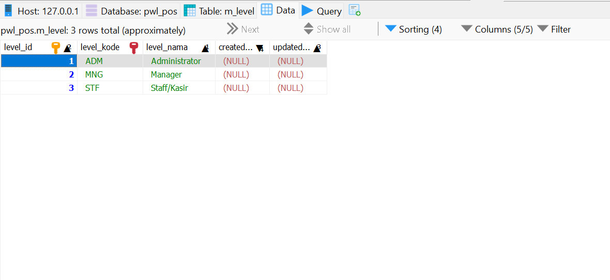
Seeder untuk tabel m_user
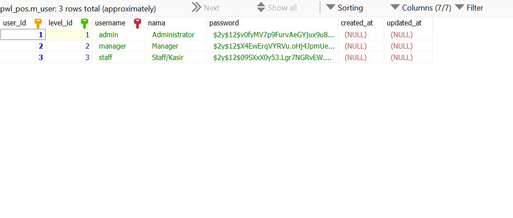
Data seeder untuk table m_kategori, m_supplier, m_barang, t_stok, t_penjualan, t_penjualan_detail

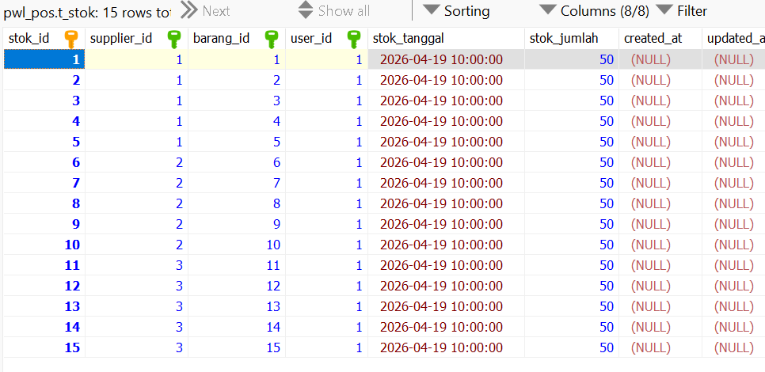

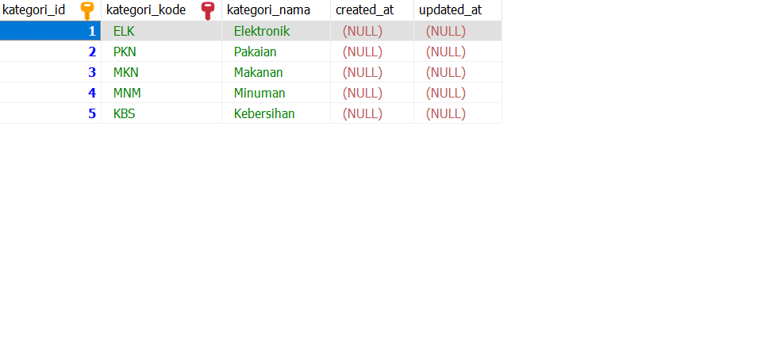
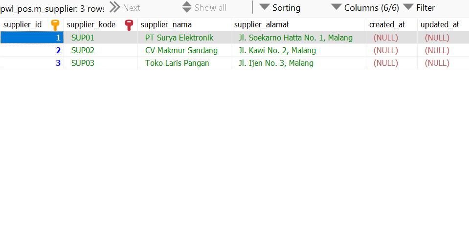

---

## Praktikum 4 - DB Façade
Implementasi *raw query* menggunakan fitur DB Façade untuk operasi CRUD[cite: 376, 377].

### Hasil Pengamatan (LevelController)
* **Update dan Hapus**

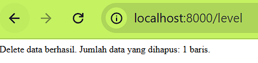

* **Menampilkan Data (view)**

---

## Praktikum 5 - Query Builder
* **Update dan Hapus**
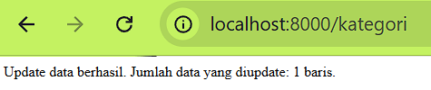
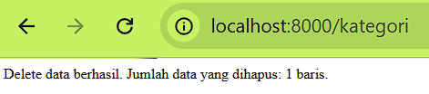

* **Menampilkan Data (view)**

### Hasil Pengamatan (KategoriController)
* Menggunakan `DB::table('m_kategori')->insert()` untuk menambah data.
* Menggunakan method `where()` dan `update()` untuk mengubah data.
* Menampilkan data ke view melalui objek yang lebih terstruktur dibanding raw query.

---

## Praktikum 6 - Eloquent ORM
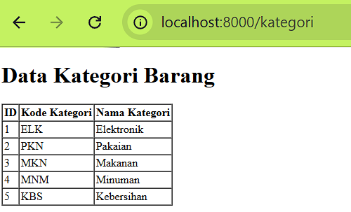

### Hasil Pengamatan (UserController)
* Dibuat file `UserModel.php` untuk merepresentasikan tabel `m_user`.
* Pengambilan data dilakukan dengan memanggil `UserModel::all()` yang mengembalikan seluruh data dalam bentuk koleksi objek.
* Operasi database menjadi lebih intuitif karena setiap baris tabel dianggap sebagai properti dari sebuah objek.

---

## Jawaban Pertanyaan (Penutup)
1.  **Fungsi `APP_KEY`**: digunakan untuk enkripsi data (seperti session dan cookie) agar data aplikasi tetap aman
2. **Generate `APP_KEY`**: Menggunakan perintah `php artisan key:generate`.
3. **Default Migration**: Terdapat 3 file bawaan (users, password_reset_tokens, failed_jobs)
4. **Tujuan `timestamps()`**: Otomatis membuat kolom `created_at` dan `updated_at` untuk mencatat waktu manipulasi data.
5.  **Tipe data `id()`**: Menghasilkan tipe data *Big Integer Unsigned Auto Increment*.
6.  **Perbedaan `id()` vs `id('level_id')`**: `id()` membuat nama kolom default `id`, sedangkan `id('level_id')` secara eksplisit memberi nama kolom tersebut `level_id`
7.  **Fungsi `unique()`**: Memastikan data pada kolom tersebut tidak ada yang kembar
8.  **UnsignedBigInteger vs ID**: Kolom relasi harus menggunakan `unsignedBigInteger` agar tipe datanya sama persis dengan kolom `id` di tabel induk agar relasi bisa terbentuk.
9.  **Tujuan Class Hash**: Untuk melakukan *hashing* (enkripsi satu arah) pada password pengguna agar tidak bisa dibaca dalam bentuk teks biasa.
10. **Tanda Tanya (?) pada Query**: Sebagai *placeholder* (parameter binding) untuk mencegah serangan SQL Injection.
11. **Protected `$table` dan `$primaryKey`**: Memberitahu Laravel bahwa model ini secara manual merujuk pada tabel `m_user` dan menggunakan `user_id` sebagai kunci utamanya, bukan nama default Laravel
12. **Metode Termudah**: Eloquent ORM sering dianggap paling mudah karena sintaksnya sangat mendekati bahasa manusia dan integrasi objeknya sangat kuat di Laravel[cite: 560].