# Jobsheet 1: Instalasi & Konfigurasi Laravel

Nama: Mochamad Reza Firdaus

NIM: 244107020104

Praktikum 1
-	Instalasi Framework Laravel
 

Praktikum 2
-	Menjalankan Web Framework Laravel
 
 

	Praktikum 3 
-	Membuat repository pada github
 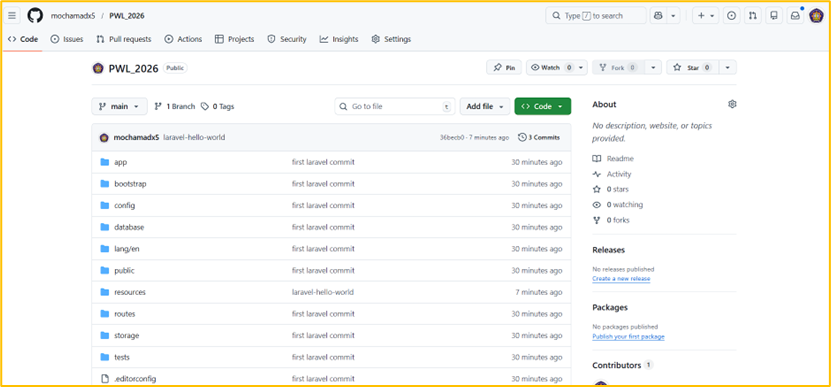
 
Link repo : https://github.com/mochamadx5/PWL_2026 

-	Mengubah Tampilan HTML
 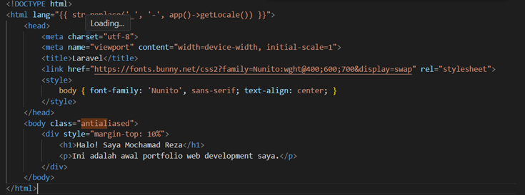
 
	 

-	Version control atau perubahan kode 
 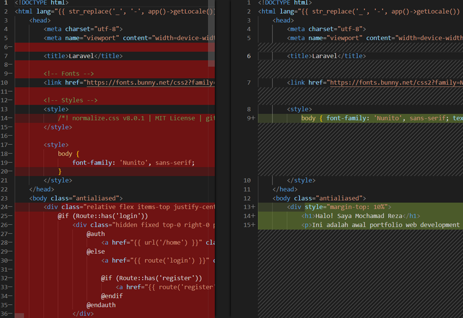
 

-	Laravel Hello World
 
 

LINK GITHUB :
https://github.com/mochamadx5/PWL_2026 

# Jobsheet 2 :
-	Praktikum 1 

Menampilkan route Hello 

Menampilkan route world 

Menampilkan selamat datang 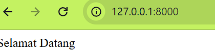

Menampilkan route about (data diri) 

Menampilkan route paramaters user 
Muncul "Not Found" itu karena rute /user/{name} wajib untuk diiisi sesuatu di posisi parameter {name} tersebut.

Menampilkan multi paramaters 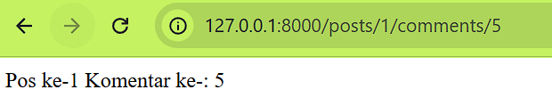
Laravel memungkinkan sebuah route untuk menerima lebih dari satu parameter dinamis sekaligus melalui URL. Parameter yang diketikkan pengguna pada URL akan ditangkap dan diteruskan ke dalam argumen callback function secara berurutan. Selain itu, penamaan variabel di dalam fungsi (seperti $postId dan $commentId) bebas dan tidak harus sama persis dengan nama parameter di route, karena Laravel memetakannya secara otomatis berdasarkan urutan posisinya.

Menampilkan route paramaters sendiri 

memanggil route/user sekaligus mengirimkan parameter berupa nama user dimana parameter bersifat opsional 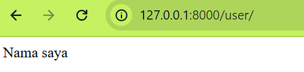

memanggil route/user sekaligus mengirimkan parameter berupa nama user dimana parameter bersifat opsional 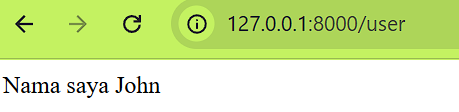
Ketika URL diakses tanpa memasukkan parameter nama, halaman tetap dapat berjalan tanpa error karena penggunaan parameter opsional {name?} yang didukung dengan pemberian nilai default pada variabel fungsi. Dalam kode ini, variabel $name telah diatur memiliki nilai bawaan berupa 'John', sehingga saat URL tidak mengirimkan data apa pun, sistem secara otomatis akan menggunakan nilai tersebut sebagai output.

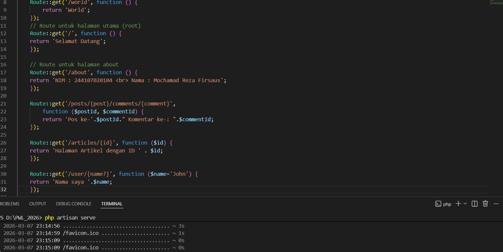

-	Praktikum 2 
Controller mulai mengambill logic aplikasi
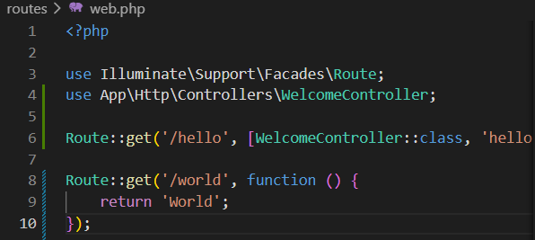
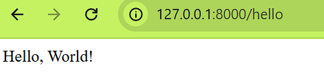

Page controller routes logic
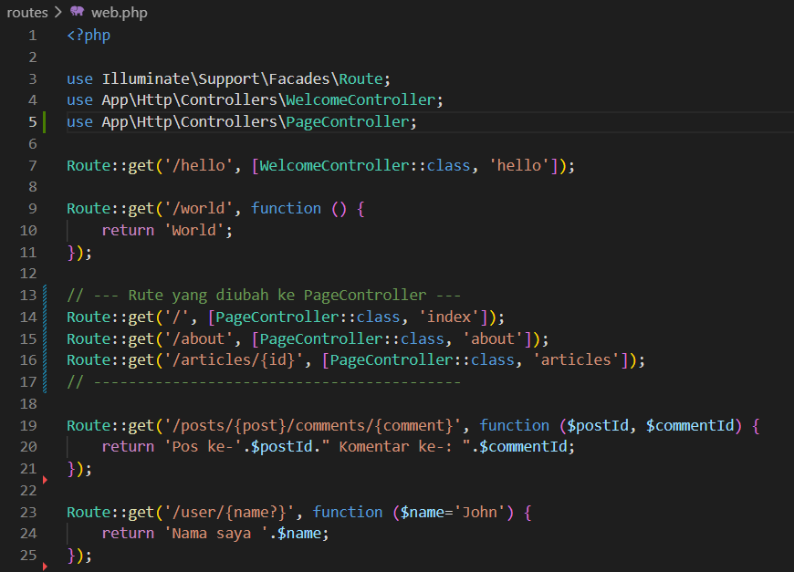
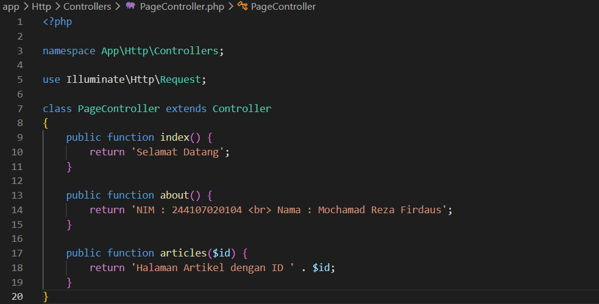

Resource controller
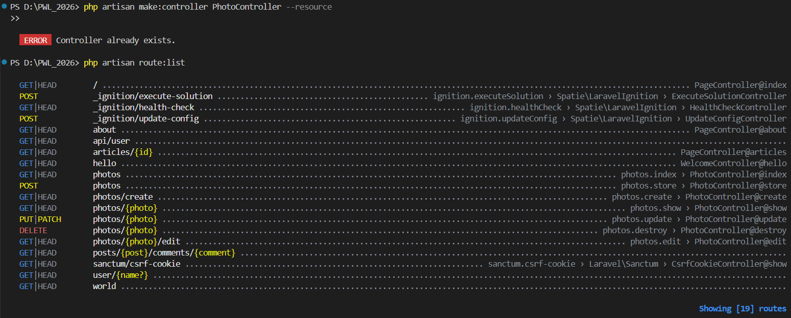
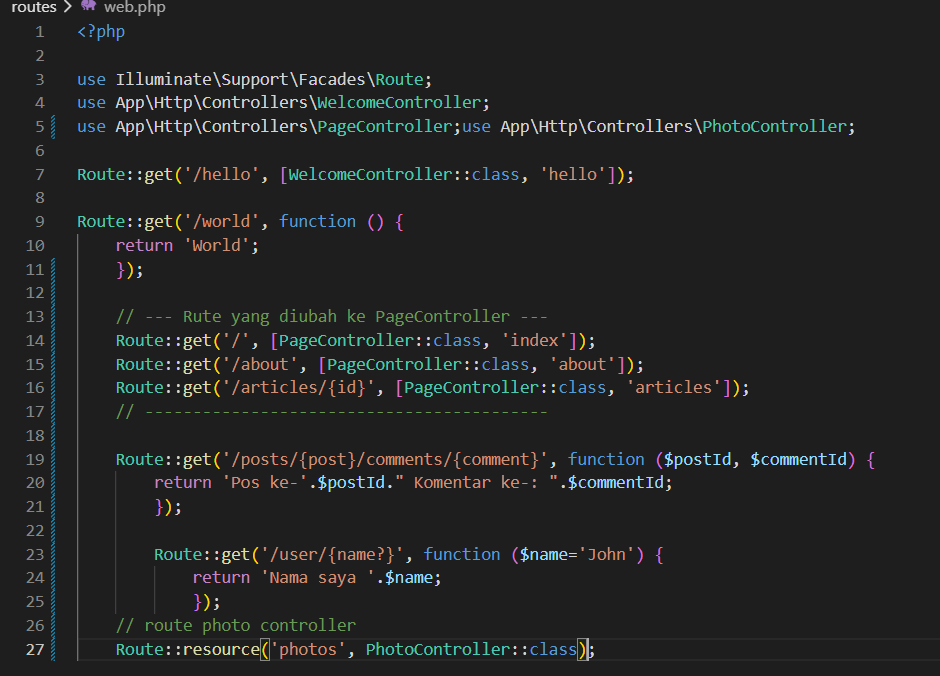
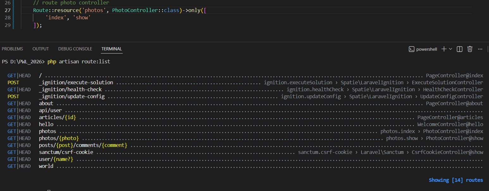

-	Praktikum 3 - View
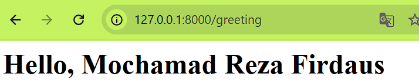
Saat URL /greeting diakses, halaman web menampilkan teks "Hello, Mochamad Reza Firdaus" dalam ukuran h1. Hal ini terjadi karena rute tidak langsung mencetak teks, melainkan memanggil file View hello.blade.php.

View direktori
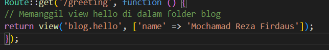

Hasil yang ditampilkan pada halaman web tetap sama persis dengan praktikum sebelumnya. Perbedaannya terletak pada struktur folder dan cara pemanggilan file View di dalam rute. Karena file hello.blade.php telah dipindahkan ke dalam sub-direktori blog, pemanggilannya pada fungsi view() harus menggunakan sintaks titik, yaitu view 'blog.hello'

Menampilkan view dari controller
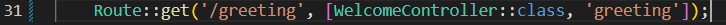
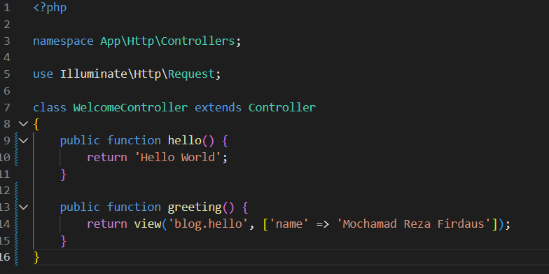

hasil yang ditampilkan pada halaman web tetap sama, yaitu teks "Hello, Mochamad Reza Firdaus". Namun, secara arsitektur, kode telah mengimplementasikan pola MVC dengan benar. Alur pemrosesannya berubah menjadi: Route menerima permintaan dari URL /greeting dan meneruskannya ke WelcomeController pada metode greeting(). Kemudian, Controller tersebut bertugas menyiapkan data array berisi nama dan memanggil View blog.hello untuk merender tampilan HTML-nya. Pemisahan tugas ini membuat kode menjadi lebih terstruktur dan mudah dikelola untuk aplikasi skala besar.

With Method
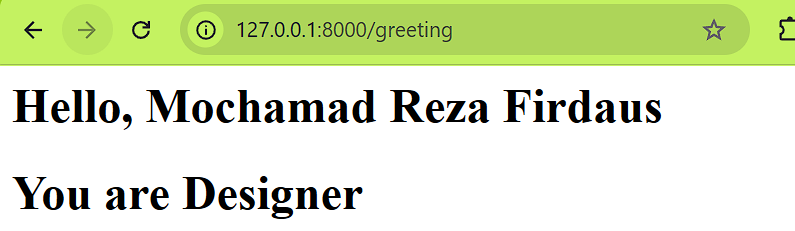
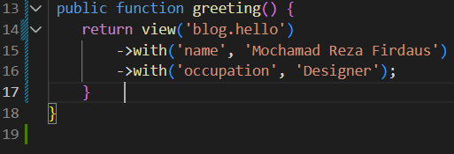
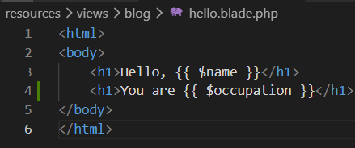

halaman web kini menampilkan dua baris teks h1, yaitu nama dan pekerjaan. Hal ini membuktikan bahwa pengiriman data dari Controller ke View tidak hanya terbatas menggunakan format array asosiatif tunggal , tetapi juga bisa menggunakan metode berantai/chaining with(). Metode with() mengembalikan instance view sehingga memungkinkan kita untuk menyisipkan beberapa potong data individual secara berurutan sebelum merendernya ke layar. Pada sisi View, kedua data tersebut berhasil ditangkap secara mandiri menggunakan sintaks {{ $name }} dan {{ $occupation }}
