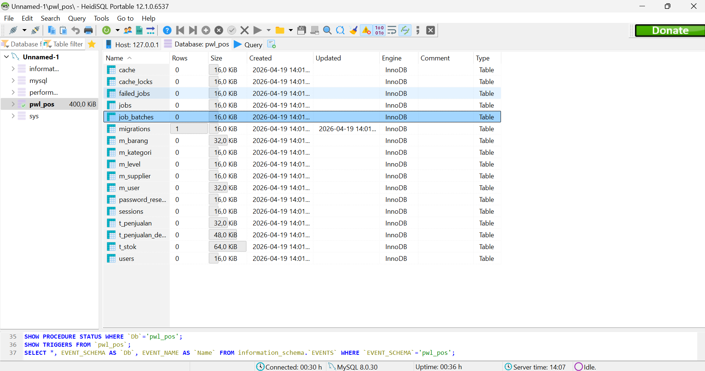
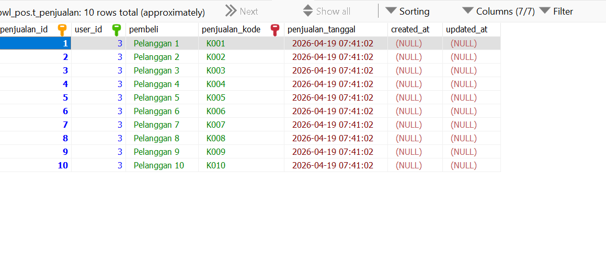
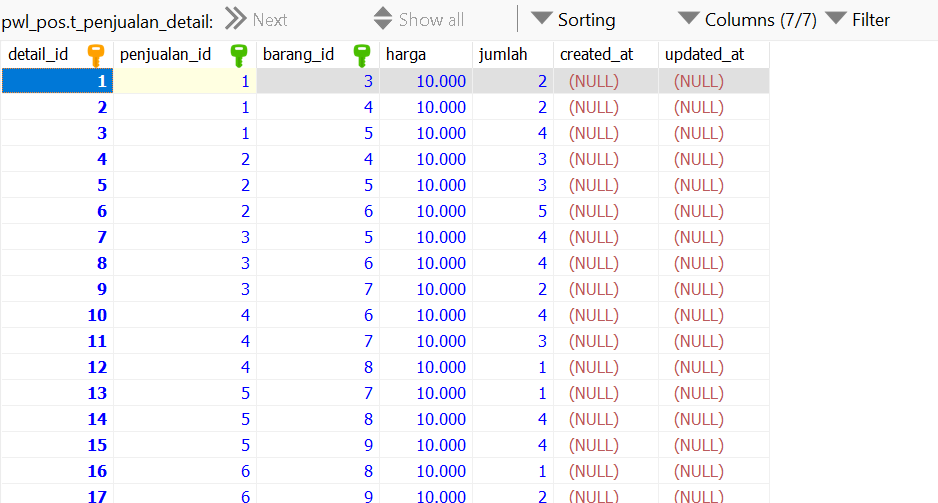
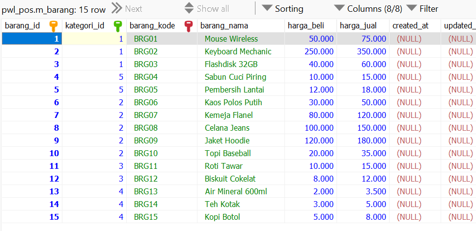
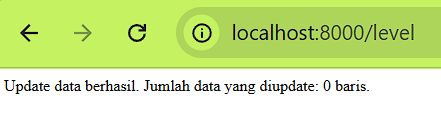
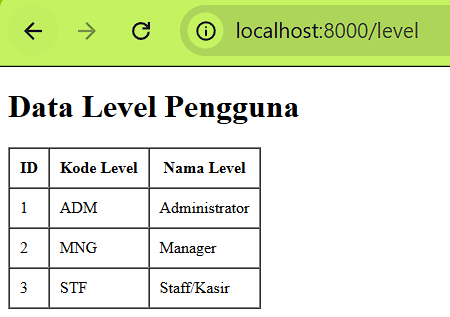

# Laporan Praktikum - Jobsheet 3: Migration, Seeder, DB Façade, Query Builder, dan Eloquent ORM

---

## Identitas Mahasiswa
* **Nama:** Mochamad Reza Firdaus
* **NIM:** 244107020104
* **Kelas:** TI-2F
* **Project:** PWL_POS

---

## Praktikum 1 - Pengaturan Database
**Set up database**

## Praktikum 2 - Migration
**Migration**

### Praktikum 2.1 - Pembuatan File Migrasi Tanpa Relasi
[cite_start]Pembuatan tabel utama yang tidak memiliki *Foreign Key* terlebih dahulu[cite: 159].
1.  [cite_start]**Tabel `m_level`**: Menyimpan data level pengguna[cite: 247].

2.  [cite_start]**Tabel `m_kategori`**: Menyimpan kategori produk[cite: 307].

3.  [cite_start]**Tabel `m_supplier`**: Menyimpan data pemasok barang[cite: 307].

tampilan database

### Praktikum 2.2 - Pembuatan File Migrasi Dengan Relasi
Seluruh tabel hasil migrasi (heidiSQL), relasi sudah ada

## Praktikum 3 - Seeder
[cite_start]Seeder digunakan untuk mengisi database dengan data awal atau data *dummy* agar aplikasi siap digunakan untuk pengujian[cite: 331, 332].

### Hasil Pengamatan
* [cite_start]Berhasil memasukkan data awal ke tabel `m_level` dan `m_user` melalui perintah `php artisan db:seed`[cite: 336, 353].
Seeder untuk tabel m_level

Seeder untuk tabel m_user

Data seeder untuk table m_kategori, m_supplier, m_barang, t_stok, t_penjualan, t_penjualan_detail

---

## Praktikum 4 - DB Façade
Implementasi *raw query* menggunakan fitur DB Façade untuk operasi CRUD[cite: 376, 377].

### Hasil Pengamatan (LevelController)
* **Update dan Hapus**

* **Menampilkan Data (view)**

---

## Praktikum 5 - Query Builder
[cite_start]Implementasi operasi database menggunakan method-method yang disediakan oleh Laravel tanpa menulis SQL murni[cite: 439, 440].

### Hasil Pengamatan (KategoriController)
* Menggunakan `DB::table('m_kategori')->insert()` untuk menambah data[cite: 451, 470].
* [cite_start]Menggunakan method `where()` dan `update()` untuk mengubah data[cite: 454, 478].
* [cite_start]Menampilkan data ke view melalui objek yang lebih terstruktur dibanding raw query[cite: 465, 489].

---

## Praktikum 6 - Eloquent ORM
[cite_start]Implementasi teknik pemetaan tabel ke dalam bentuk objek (Model)[cite: 501, 502].

### Hasil Pengamatan (UserController)
* [cite_start]Dibuat file `UserModel.php` untuk merepresentasikan tabel `m_user`[cite: 512, 517].
* [cite_start]Pengambilan data dilakukan dengan memanggil `UserModel::all()` yang mengembalikan seluruh data dalam bentuk koleksi objek[cite: 523, 537].
* Operasi database menjadi lebih intuitif karena setiap baris tabel dianggap sebagai properti dari sebuah objek[cite: 501].

---

