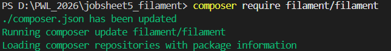
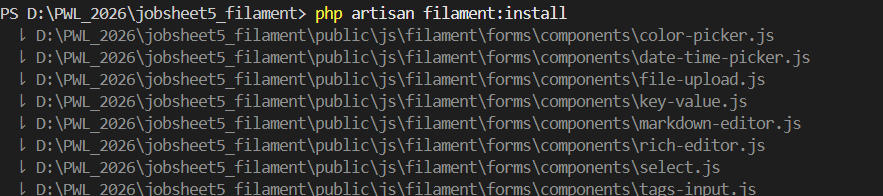
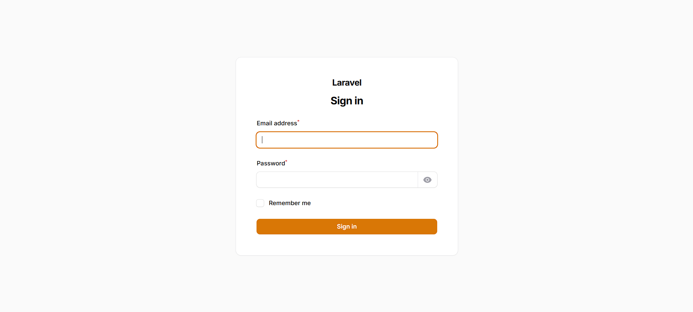
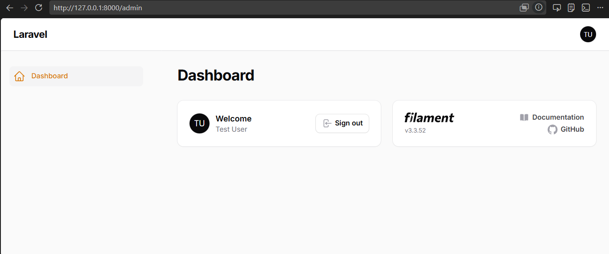
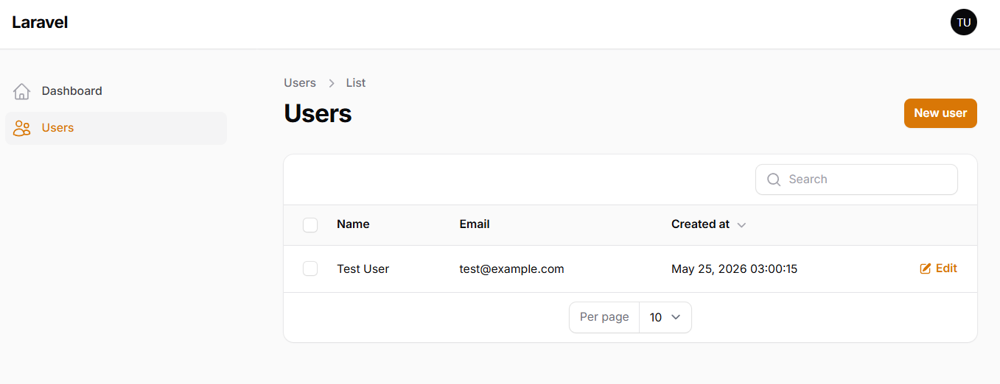
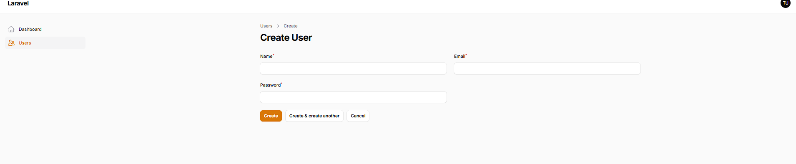

# Laporan Instalasi dan Konfigurasi Filament di Laravel

## Deskripsi
Dokumen ini menjelaskan proses instalasi Filament pada Laravel, mulai dari konfigurasi PHP, Composer, hingga berhasil menjalankan panel admin dengan database MySQL melalui LARAGON.

---

## 1. Instalasi Filament

### Instalasi Package Filament

### Login Filament Admin

### Dashboard Login Filament

### Dashboard berhasil login Filament

## 2. CRUD jobsheet 2
### Tampilan user dan table

