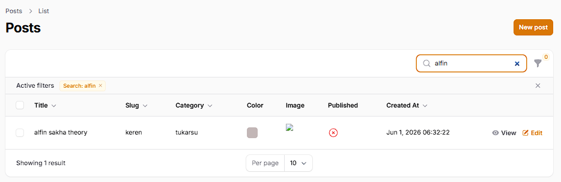
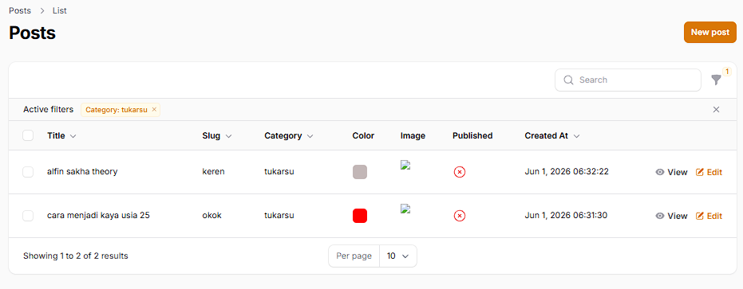

## 1. Pertemuan 11: Implementasi Search & Filter pada Table Filament
Pada pertemuan ini, tabel Post diberikan fitur pencarian teks dan penyaringan data untuk memudahkan pengguna saat mengelola data yang banyak[cite: 6].

### Dokumentasi Implementasi search dan filter

- Implementasi searching
Fitur pencarian ditambahkan menggunakan method `searchable()` pada kolom teks (seperti Title, Slug, dan Category)[cite: 6]. Hasil pencarian akan memfilter data di tabel secara otomatis dan *real-time* saat pengguna mengetikkan kata kunci[cite: 6].

- Implementasi filter
Fitur penyaringan ditambahkan menggunakan `Filter` dengan komponen `DatePicker` untuk menyortir data berdasarkan tanggal pembuatan. Selain itu, `SelectFilter` juga diterapkan agar pengguna dapat memfilter tabel berdasarkan relasi Kategori melalui menu.
