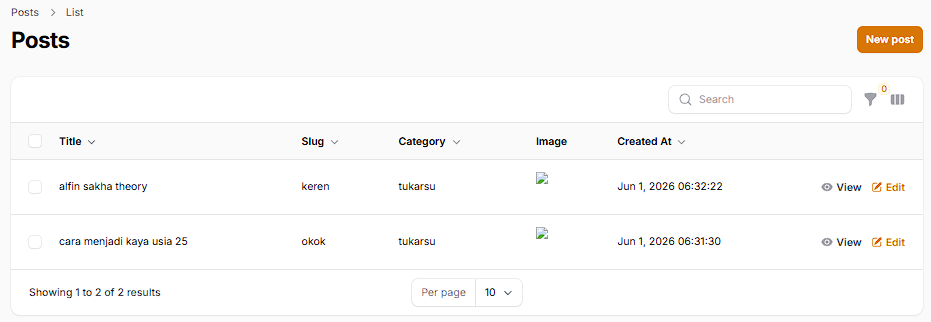
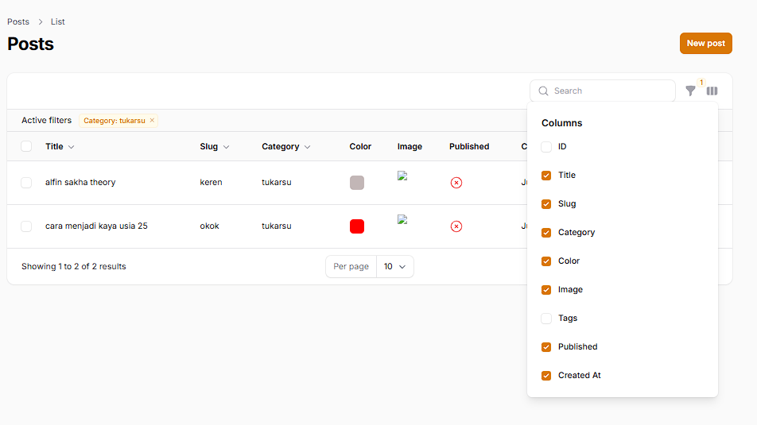

## 1. Pertemuan 12: Implementasi Toggle Table

Fitur Toggle Column ditambahkan agar pengguna dapat mengatur visibilitas kolom pada tabel secara fleksibel. Beberapa kolom teknis seperti `ID` dan `Tags` diatur agar tersembunyi secara bawaan menggunakan method `toggleable(isToggledHiddenByDefault: true)`, sedangkan kolom lainnya menggunakan `toggleable()` biasa.

### Tampilan sebelum implementasi toggle table

### Dokumentasi Toggle table

- Tampilan toggle table
Menu toggle memunculkan daftar kolom yang tersedia. Kolom ID dan Tags otomatis tidak tercentang (tersembunyi secara default).

- Menghilangkan beberapa centang kolom (color & status publis)
Tabel menyesuaikan secara *real-time* ketika preferensi kolom diubah oleh pengguna.

### Analisis & Diskusi

1. **Mengapa toggle column penting pada admin panel?**
   Toggle column sangat penting untuk menjaga antarmuka pengguna (UI) tetap rapi dan tidak penuh sesak (cluttered). Pada tabel database dengan banyak kolom, fitur ini memberikan fleksibilitas bagi pengguna untuk hanya memunculkan data yang relevan dan sedang mereka butuhkan saat itu.

2. **Apa perbedaan toggleable() biasa dengan isToggledHiddenByDefault?**
   - `toggleable()`: Kolom otomatis **tampil** secara default saat halaman dimuat, namun bisa disembunyikan. 
   - `isToggledHiddenByDefault: true`: Kolom otomatis **tersembunyi** secara default saat halaman dimuat, namun pengguna tetap bisa memunculkannya melalui menu toggle.

3. **Mengapa preferensi kolom tetap tersimpan?**
   Filament memanfaatkan fitur *Session* pada Laravel atau Local Storage browser untuk menyimpan preferensi pengguna. Setiap kolom yang dicentang atau dihilangkan centangnya akan direkam, sehingga *layout* tabel tidak akan kembali ke awal meskipun pengguna berpindah halaman atau me-*refresh* browser.

4. **Kapan sebaiknya kolom disembunyikan secara default?**
   Kolom sebaiknya disembunyikan secara default ketika informasi di dalamnya bersifat teknis atau bukan data primer yang perlu dilihat sehari-hari (contoh: kolom `ID`, `Tags`, `deleted_at`). Hal ini mencegah kolom tersebut memakan ruang layar secara percuma, meski sesekali tetap bisa diakses jika dibutuhkan.