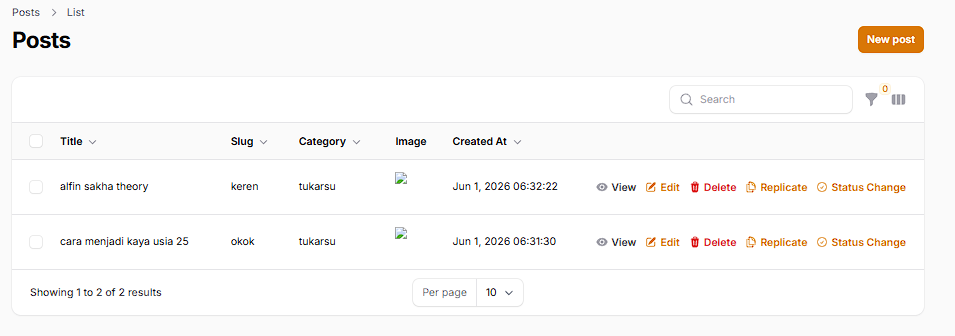
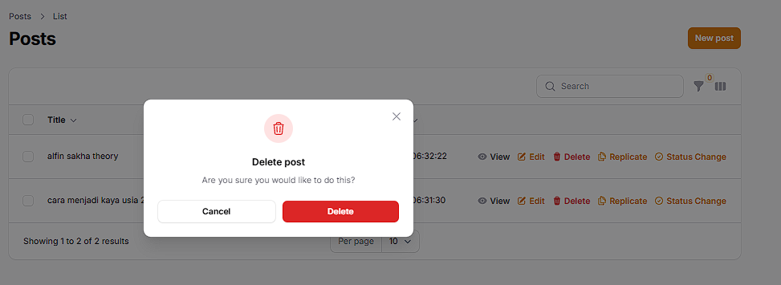
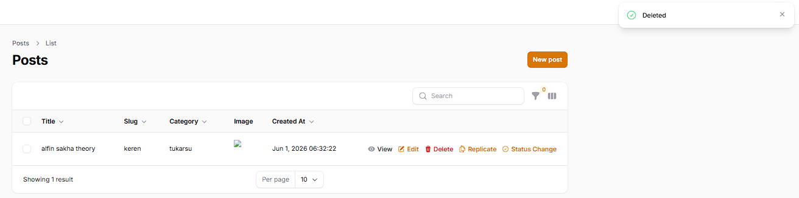
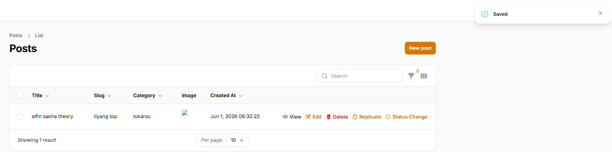
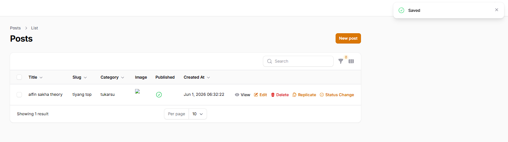

## 1. Pertemuan 13: Implementasi Table Action
Pada pertemuan ini, fungsionalitas tabel ditingkatkan dengan menambahkan tombol aksi (Table Actions) langsung pada baris data. Hal ini membuat pengelolaan data menjadi lebih cepat dan efisien tanpa harus selalu membuka halaman edit secara terpisah.

### Fitur Delete dan Edit (Aksi Bawaan & Kustom)

- **Implementasi Fitur Delete**
Tombol hapus (`DeleteAction`) ditambahkan langsung ke dalam tabel. Saat diklik, sistem akan menampilkan pop-up konfirmasi (confirmation modal) terlebih dahulu untuk mencegah penghapusan data secara tidak sengaja, lalu menghapus data tanpa memuat ulang halaman.

- **Implementasi Fitur Replicate & Custom Action (Published)**
Selain menambahkan aksi bawaan seperti `ReplicateAction` untuk menggandakan baris data secara instan, ditambahkan juga sebuah *Custom Action* bernama "Status Change". Aksi kustom ini memunculkan form *checkbox* di dalam pop-up modal untuk memperbarui status `Published` langsung ke *database*.

### Analisis & Diskusi

1. **Mengapa action di tabel lebih efisien dibanding halaman edit?**
   Karena tindakan langsung pada tabel memangkas jumlah klik dan waktu tunggu *loading* (perpindahan halaman). Pengguna dapat melakukan perubahan cepat seperti menghapus data, menggandakan data, atau mengubah status spesifik langsung dari halaman daftar (List), yang sangat mempercepat *workflow* manajemen data massal.

2. **Apa perbedaan predefined action dan custom action?**
   - **Predefined action** (seperti `EditAction`, `DeleteAction`, `ReplicateAction`): Fungsionalitas yang sudah disediakan bawaan oleh Filament. Pengembang tinggal memanggilnya tanpa perlu memikirkan logika pemrosesan ke *database*.
   - **Custom action** (menggunakan `Action::make()`): Fungsi aksi kosong di mana logika penanganan data, bentuk *form* inputannya, dan proses *update* datanya harus ditulis secara manual oleh pengembang menggunakan *callback/closure*.

3. **Bagaimana cara menambahkan validasi dalam custom action?**
   Validasi dapat ditambahkan langsung pada komponen form di dalam metode `->form([])` milik aksi tersebut. Contohnya dengan menyambungkan metode bawaan seperti `->required()` atau `->numeric()`. Filament akan otomatis memvalidasi input tersebut sebelum tombol *submit* diizinkan untuk memicu metode `->action()`.

4. **Kapan kita menggunakan Replicate?**
   Tindakan `Replicate` (Gandakan) sangat berguna ketika pengguna ingin membuat *record* baru yang sebagian besar datanya sama persis dengan data lama. Pengguna tidak perlu mengetik ulang seluruh formulir yang panjang dari nol, cukup menyalin data lama dan mengubah bagian yang berbeda saja (seperti *Title* atau *Slug*).