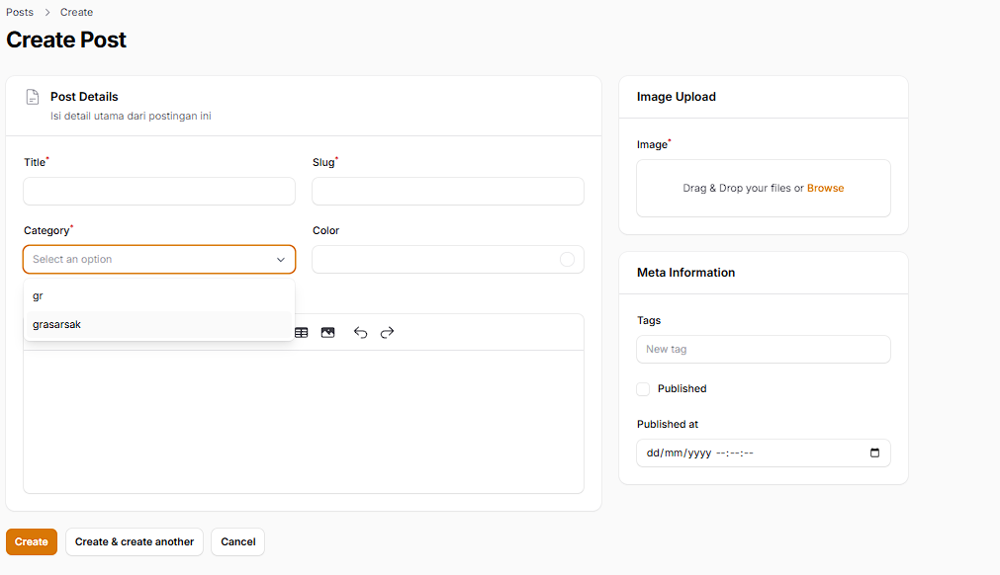
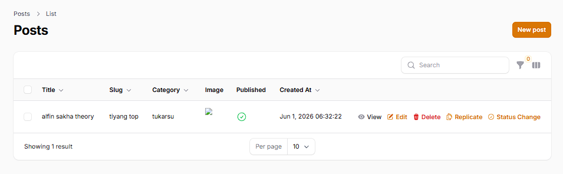
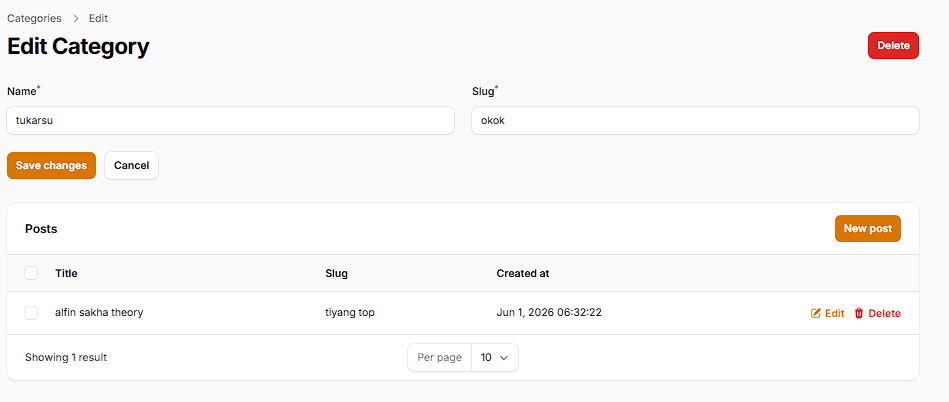
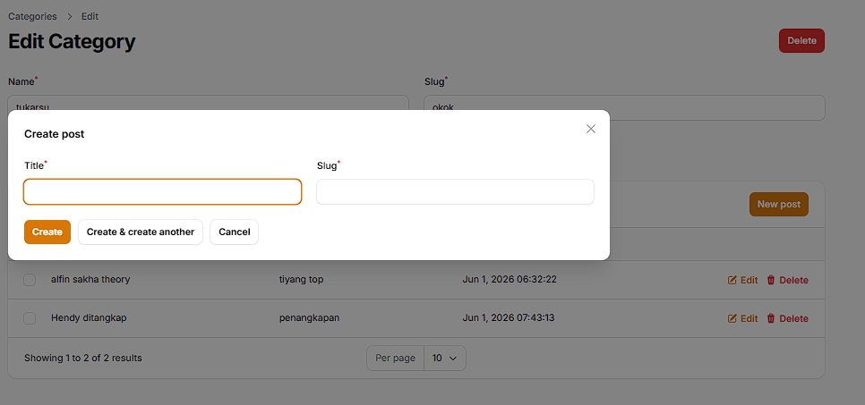

## 1. Pertemuan 14: Implementasi Relation pada Filament (HasMany)
Pada pertemuan ini, relasi antar tabel (Category dan Post) diimplementasikan ke dalam antarmuka Filament. Tujuannya adalah untuk mempermudah pengelolaan data yang saling terhubung (HasMany dan BelongsTo) secara efisien langsung dari panel admin.

### Dokumentasi Implementasi Relasi

- **Dropdown kategori pada Post Form**
Menggunakan method `relationship()` dan `searchable()` agar dropdown dapat mengambil data relasi secara otomatis dan menyertakan fitur pencarian untuk dataset yang besar.

- **Tabel Post dengan Kategori**
Menampilkan nama kategori yang berelasi langsung pada tabel Post menggunakan parameter `category.name`.

- **Relationship Manager pada Category**
Menampilkan daftar tabel Post yang terhubung/dimiliki oleh suatu Kategori langsung di dalam halaman Edit Category menggunakan Relation Manager.

- **Create Post dari Category**
Membuat Post baru langsung dari dalam halaman Edit Category. Nilai *foreign key* (`category_id`) akan terisi secara otomatis mengikuti kategori yang sedang diedit.
 

### Analisis & Diskusi

1. **Apa perbedaan relationship() dengan options()?**
   - `relationship()` otomatis mengelola kueri ke *database*, memuat data secara efisien (*eager loading*), dan secara otomatis menangani penyimpanan *Foreign Key* saat form di-*submit*.
   - `options()` mengharuskan pengembang untuk mendefinisikan *array* atau memanggil kueri secara manual (misalnya `Category::pluck('name', 'id')`), yang kurang efisien jika digunakan untuk relasi tabel dan dataset yang besar.

2. **Mengapa searchable penting untuk dataset besar?**
   Jika tabel memiliki ribuan data (misalnya 10.000 kategori), memuat semuanya sekaligus ke dalam menu *dropdown* akan membebani server dan membuat *browser* pengguna menjadi lambat/hang. Fitur `searchable()` menyelesaikan masalah ini karena data tidak dimuat sekaligus di awal, melainkan dicari ke *database* secara dinamis sesuai dengan kata kunci yang diketik oleh pengguna.

3. **Apa fungsi Relationship Manager pada Filament?**
   Relationship Manager berfungsi untuk mengelola data relasi (*create, read, update, delete*) secara langsung dari halaman antarmuka sang induk (parent resource). Pengguna dapat mengelola data turunan tanpa perlu berpindah-pindah menu navigasi, sehingga mengurangi kesalahan input dan membuat UI lebih kompak.

4. **Kapan menggunakan HasMany dan BelongsTo?**
   - **HasMany** digunakan pada Model Induk (Parent) yang "memiliki" banyak data turunan. Contoh: Satu `Category` *memiliki banyak* `Post`.
   - **BelongsTo** digunakan pada Model Anak (Child) yang memegang kolom *Foreign Key* (misal: `category_id`) yang menunjuk kembali ke induknya. Contoh: Satu `Post` *dimiliki oleh* satu `Category`.