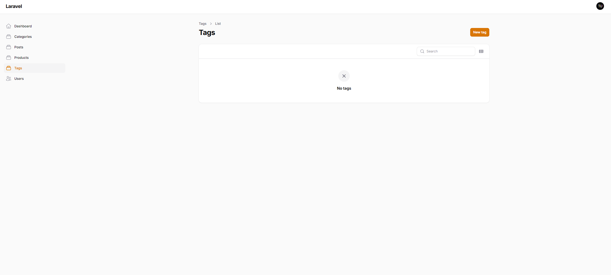
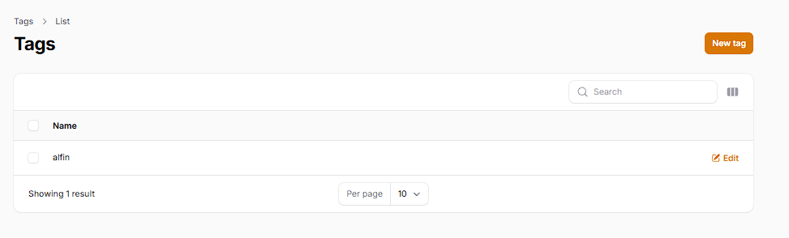
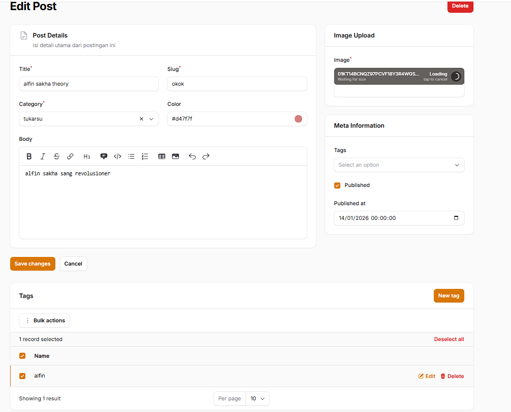
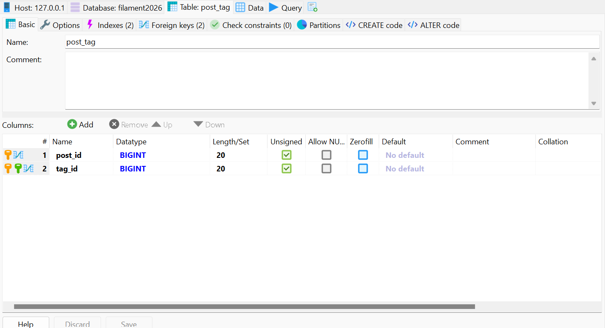

## 1. Pertemuan 15: Implementasi Many-to-Many Relationship pada Filament

Pada pertemuan ini, relasi *Many-to-Many* diimplementasikan antara tabel `posts` dan `tags` menggunakan tabel *pivot* (`post_tag`). Pembaruan ini bertujuan untuk menggantikan penyimpanan tag berbentuk JSON agar data lebih terstruktur, di mana satu postingan dapat memiliki banyak tag, dan satu tag dapat digunakan oleh banyak postingan.

### Dokumentasi Menu Tag dan Form Post

- **Menu Tag pada Admin Panel**
Menu *Resource* mandiri berhasil dibuat untuk mengelola data master Tag (CRUD) secara independen di luar form Post.

- **Implementasi Multiple Select pada Form Post**
Pengguna dapat menambahkan dan memilih lebih dari satu tag sekaligus (*multiple select*) saat membuat atau mengedit Post berkat relasi `belongsToMany`.

### Dokumentasi Relationship Managers & Database

- **Relationship Manager (Tags & Post)**
Tabel Relationship Manager ditambahkan di halaman Edit Post, memungkinkan pengguna untuk mengelola relasi tag menggunakan aksi *Attach* (menyambungkan) dan *Detach* (melepaskan) secara spesifik.

- **Database Pivot Table (post_tag)**
Pembuktian pada *database* bahwa tabel *pivot* (`post_tag`) berhasil menyimpan data relasi antara `post_id` dan `tag_id` secara otomatis ketika proses *Attach* dilakukan.
 

### Analisis & Diskusi

1. **Apa perbedaan HasMany dan Many-to-Many?**
   - **HasMany (One-to-Many):** Relasi searah di mana satu data induk memiliki banyak data anak, dan *Foreign Key* disimpan langsung di dalam tabel anak tersebut.
   - **Many-to-Many:** Relasi dua arah di mana satu induk bisa memiliki banyak anak, dan satu anak bisa dimiliki banyak induk. Relasi ini wajib menggunakan *pivot table* untuk menghubungkan kedua tabel utama.

2. **Mengapa pivot table diperlukan?**
   Pivot table sangat diperlukan untuk menghubungkan tabel `posts` dan `tags` karena berfungsi sebagai tempat penyimpanan *Foreign Key* dari kedua tabel tersebut (yaitu `post_id` dan `tag_id`). Tanpa pivot table, *database* tidak bisa memetakan hubungan banyak-ke-banyak dengan rapi.

3. **Apa fungsi attach dan detach pada Filament?**
   Pada Relationship Manager, aksi **Attach** berfungsi untuk menyambungkan relasi antara data yang sudah ada di *database* ke dalam tabel *pivot*. Sedangkan **Detach** berfungsi untuk memutuskan relasi tersebut dari tabel *pivot* tanpa menghapus data master aslinya.

4. **Mengapa JSON column kurang baik untuk relasi?**
   Menyimpan data tag dalam format teks JSON (contoh: `["Laravel 12", "PHP"]`) sangat dihindari karena membuat data sulit dimodifikasi, memicu duplikasi data, tidak terstruktur, dan membuat *query database* menjadi sangat lambat dan tidak efisien.