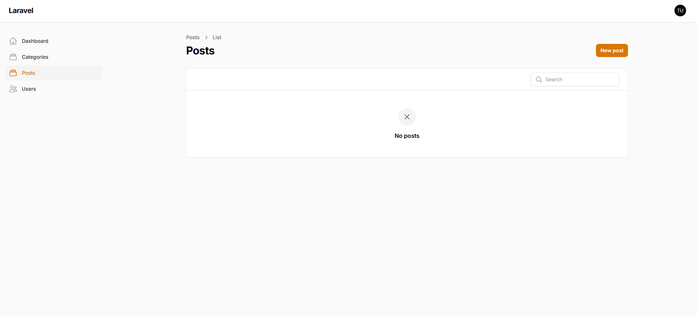
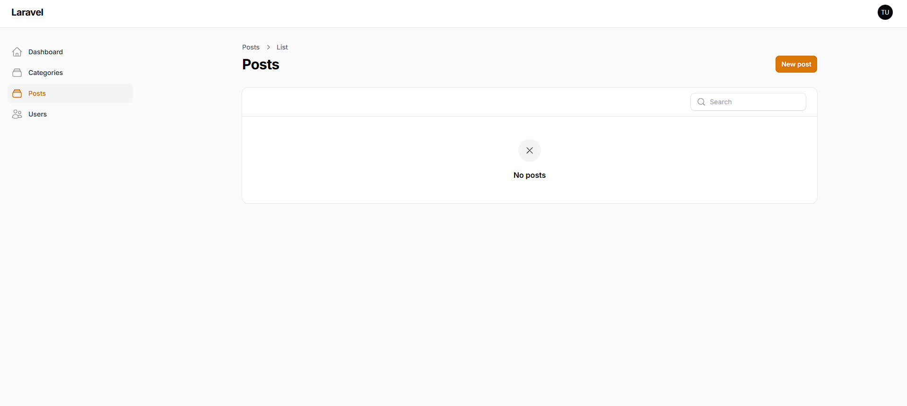

# Laporan Instalasi dan Konfigurasi Filament Pertemuan 6

## Deskripsi
Dokumen ini menjelaskan proses konfigurasi method Post pada Filament, termasuk pembuatan Resource untuk Post, migration database, model, dan tampilan halaman Post di admin panel.

---

## 1. Mengkonfigurasi method post

### menampilkan halaman post

1. **Membuat Migration untuk Post**
   - Membuat tabel posts dengan field: id, title, content, category_id, user_id, timestamps

2. **Membuat Model Post**
   - Model Post dengan relasi ke Category dan User

3. **Membuat Resource Post di Filament**
   - Mengatur field-field yang akan ditampilkan di admin panel
   - Membuat form untuk Create dan Edit Post
   - Membuat table untuk menampilkan daftar Post