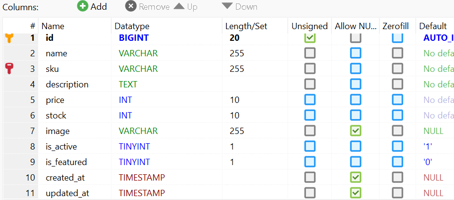
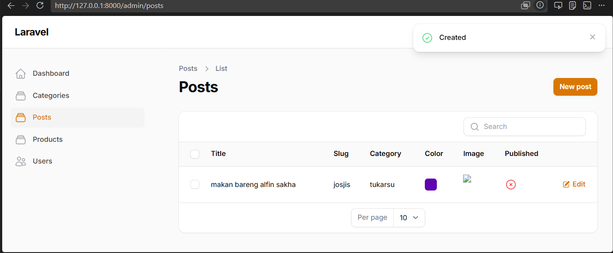
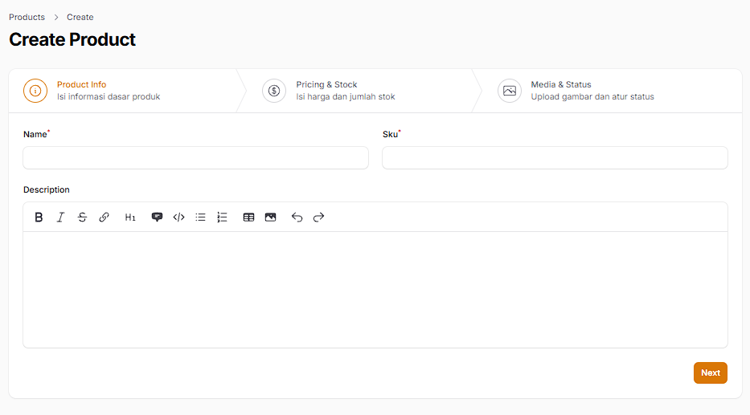
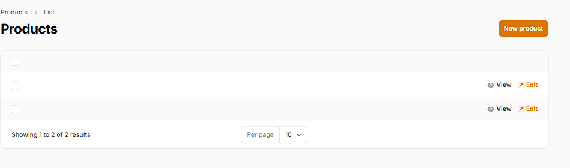
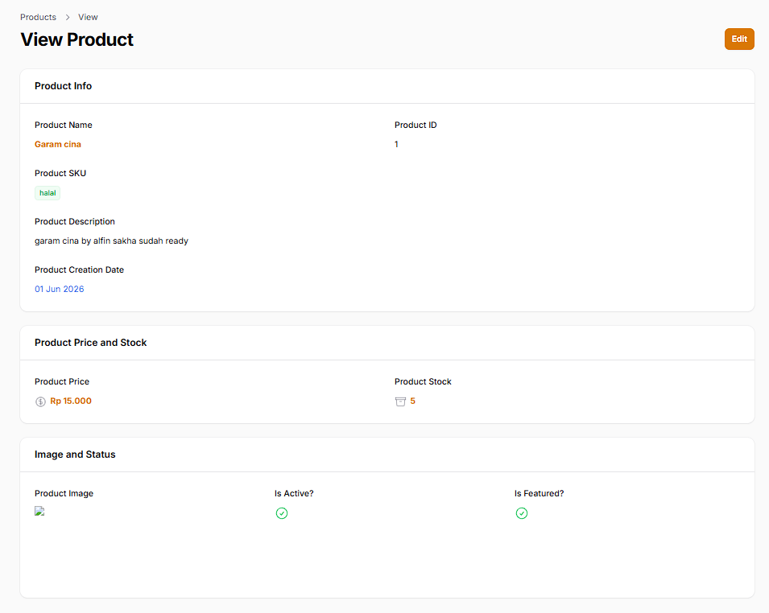

# Laporan Praktikum Pemrograman Web Lanjut - Pertemuan 7, 8, dan 9

## Deskripsi
Dokumen ini memuat dokumentasi langkah-langkah instalasi dan konfigurasi Filament untuk modul **Product**. Konfigurasi ini mencakup pembuatan form multi-tahap (Wizard Form), pengaturan halaman detail (*read-only* Info List), serta pengelompokan informasi menggunakan tata letak Tabs.

---

## 1. Pertemuan 7: Implementasi Wizard Form (Multi Step Form)
Pada tahap ini, *form* input produk diubah menjadi berjenjang agar lebih rapi dan ramah pengguna.
- **Membuat Migration & Model Product:** Menyiapkan struktur tabel `products` (name, sku, description, price, stock, image, is_active, is_featured) beserta *casting* tipe data otomatis.
- **Membuat Resource Product:** Melakukan *generate* `ProductResource` pada Filament.
- **Mengonfigurasi Wizard Form:** Membagi form `Create` dan `Edit` menjadi 3 langkah (*Step*):
  1. Product Info
  2. Pricing & Stock
  3. Media & Status
- **Kustomisasi Tombol Submit:** Menonaktifkan tombol simpan *default* bawaan halaman dan memindahkannya secara kustom ke langkah terakhir di dalam Wizard.

### Dokumentasi Tampilan Wizard Form Product
- Tampilan Database

- Tampilan Post

- Menambahkan Product

## 2. Pertemuan 8: Implementasi Info List (View Page)
Tahap ini mengubah tampilan halaman **View** produk yang sebelumnya berbentuk *form* input menjadi tampilan informasi detail.
- **Menggunakan Komponen Info List:** Menerapkan `TextEntry`, `ImageEntry`, dan `IconEntry` (untuk tipe *boolean* seperti status aktif dan unggulan).
- **Membagi Tampilan dengan Section:** Mengelompokkan detail informasi produk ke dalam kotak-kotak (*Section*).
- **Kustomisasi Tampilan:** Menambahkan modifikasi visual seperti `badge()`, `color()`, ikon, serta pemformatan tanggal yang lebih mudah dibaca.

### Dokumentasi Tampilan Info List Product
- Menampilkan List Product

